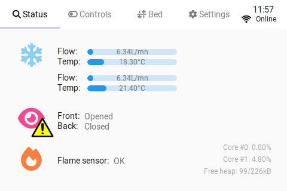
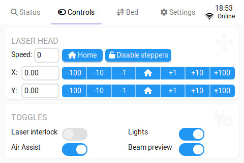
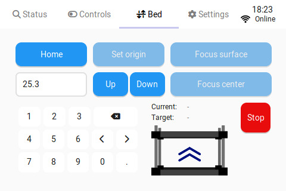
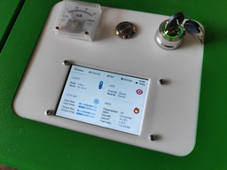

<p align="center">
  
</p>

<h1 align="center">K40 Control Panel</h1>

<p align="center"><i>Control Panel for K40 laser cutters/engravers</i></p>

<p align="center">
    
    
    
</p>

<p align="center">
    <a title="License" href="https://github.com/Lyrkan/K40-Control-Panel/blob/master/LICENSE"></a>
    
    <a title="Last release"></a>
</p>

> [!WARNING]
> I am currently testing a new iteration of the control board. This document reflects what it should look like but the code and Gerber files have **not** been updated yet. I plan to release that version in a few week, so I would recommend to wait a little bit more before jumping into this project.

## Overview

What it **CAN** do:

-   Monitor input/output coolant flow and temperature (using "YF-B4"-type sensors and thermistors)
-   Monitor lids opening state (using two microswitches)
-   Monitor for fire (using an LM393 IR flame sensor module)
-   Control the CO2 laser interlock based on the current state
-   Control a 5V/12V alarm indicator
-   Control 5V/12V lights
-   Control 5V/12V laser diodes
-   Control a motorized bed (based on [this design](https://www.printables.com/model/597476-k40-motorized-bed), but it should work with other ones as long as the stepper can be controled using a DRV8825 driver)
-   Retrieve the current state of the machine and move the laser head through UART (requires a FluidNC board)
-   Enable/disable air assist (requires a FluidNC board)
-   Expose sensors/state data through an API

What it **CANNOT** do (_yet_):

-   Start or control a job
-   Trigger the laser
-   Send arbitrary Gcode

## BOM

For the control panel:

-   1x 38 pins ESP32-S with a spacing of 24mm between pin rows (**not** 25.5mm)
-   1x ST7796 (recommended) or ILI9488 (slower) 3.95" LCD screen
-   1x DRV8825 stepper driver
-   1x L7805CV 5V regulator (a heatsink is also recommended)
-   4x IRLML6244 N-channel MOSFETs
-   4x 1N4007 diodes
-   9x 10kΩ 1/4W R1206 SMD resistors
-   3x 1kΩ 1/4W R1206 SMD resistors
-   7x 220Ω 1/4W R1206 SMD resistors
-   1x 3.3KΩ 1/4W R1206 SMD resistors
-   1x 0.1uF electrolytic capacitors
-   1x 100uF electrolytic capacitors
-   3x 0.1uF ceramic capacitors
-   4x 2.2-3V 0805 SMD LEDs
-   1x SRD-12VDC-SL-C relay
-   1x 2P PCB terminal blocks (5mm pitch)
-   some 2.54mm pin headers / XH connectors / jumpers

Other things you may need:

-   1x [FluidNC controller board](https://lasercutting.avataar120.com/en/2024/01/14/k40-lightburn-plug-play-controller-v9-xx/)
-   1x [motorized bed](https://www.printables.com/model/597476-k40-motorized-bed) with a NEMA17 stepper and a limit switch
-   1x air compressor for air assist
-   2x YF-B4 flow sensor with a thermistor (preferably one with a `50kΩ` resistance at 25°C and `B=3950K`)
-   1x LM393 IR flame sensor module
-   2x micro switches (1 for each lid you want to monitor, you can use a jumper instead if desired)
-   1x (or 2x depending on your needs) 5V/12V laser diodes
-   1x 5V/12V LED light (for the enclosure)
-   1x 5V/12V alarm module (for instance a blinking light)

## Building the firmware

Make sure you have Python 3.x installed on your system, then run:

```sh
# Install/update Platform.io
pip install --upgrade platformio

# Build the firmware (default LCD driver: ST7796)
pio build
```

Then flash your ESP32 using the `upload` target.

OTA updates are available using the `OTA` target. In order to use it copy the `.env.dist` file to `.env` and change the values of `OTA_UPLOAD_URL`, `OTA_LOGIN` and `OTA_PASSWORD` in it accordingly to the settings of your control panel.

You can also take a `.bin` file and upload it through the ElegantOTA interface available at `http://<YOUR_PANEL_IP>/update`.

## PCB

> [!TIP]
> The design fits on a 100x100mm PCB, so you should be able to get it built for really cheap by online suppliers.

Production files can be found in the [gerber](/gerber) folder of this repository.

This PCB requires some SMD soldering, this is not that hard to do but I would still recommend practicing a bit before trying to build that board.

## Wiring

[](/images/pcb-3d.png)

Some notes:

-   If you are using a different PSU for the control panel and your FluidNC board make sure that both of them have a common ground in order for UART to work as intended
-   Some MS1/MS2/MS3 jumpers have to be installed if you want to use microstepping, refer to the DRV8825 datasheet to know which ones
-   Also use jumpers to select the voltage for "Diodes" and "Lights" connectors
-   Use shielded cables if needed (and ground the shield **on one side only**)

## Showcase

[](images/DCIM_01.jpg)

## Status APIs

### System/firmware information

```
GET http://<YOUR_PANEL_IP>/api/info
```

```json
{
    "firmware": {
        "version": "9da28a82",
        "build_date": "Apr 30 2023 18:31:43"
    },
    "system": {
        "chip": {
            "model": "ESP32-D0WDQ5",
            "revision": 1
        },
        "heap": {
            "free": 80268,
            "total": 257148
        },
        "cpu": {
            "freq_mhz": 240,
            "load_percent": {
                "core_0": 0,
                "core_1": 0.100000001
            }
        },
        "tasks": {
            "display_update": {
                "state": "ready",
                "priority": 1,
                "high_water_mark": 1348
            },
            "bed_update": {
                "state": "blocked",
                "priority": 0,
                "high_water_mark": 1044
            },
            "state_update": {
                "state": "ready",
                "priority": 0,
                "high_water_mark": 600
            },
            "grbl_rx": {
                "state": "blocked",
                "priority": 1,
                "high_water_mark": 1508
            },
            "grbl_tx": {
                "state": "blocked",
                "priority": 1,
                "high_water_mark": 1992
            },
            "settings_save": {
                "state": "blocked",
                "priority": 0,
                "high_water_mark": 472
            },
            "cpu_monitor": {
                "state": "blocked",
                "priority": 0,
                "high_water_mark": 340
            },
            "async_tcp": {
                "state": "running",
                "priority": 3,
                "high_water_mark": 15064
            }
        }
    }
}
```

### Sensors status

```
GET http://<YOUR_PANEL_IP>/api/sensors
```

```json
{
    "sensors": {
        "cooling": {
            "flow": {
                "input": 5.619999886,
                "output": 5.60124556
            },
            "temp": {
                "input": 18.89999962,
                "output": 21.3
            }
        },
        "lids": {
            "front": "opened",
            "back": "closed"
        },
        "flame_sensor": {
            "triggered": false
        }
    }
}
```

### Alerts state

```
GET http://<YOUR_PANEL_IP>/api/alerts
```

```json
{
    "alerts": {
        "cooling": false,
        "lids": true,
        "flame_sensor": false
    }
}
```

### Relays/MOSFETs activation state

```
GET http://<YOUR_PANEL_IP>/api/relays
```

```json
{
    "relays": {
        "interlock": false,
        "air_assist": true,
        "cooling": true,
        "alarm": false,
        "lights": true,
        "beam_preview": true
    }
}
```

### Grbl status report

```
GET http://<YOUR_PANEL_IP>/api/grbl
```

```json
{
    "state": 1,
    "w_pos": {
        "x": 0,
        "y": 0,
        "z": 0
    },
    "m_pos": {
        "x": 0,
        "y": 0,
        "z": 0
    },
    "wco": {
        "x": 0,
        "y": 0,
        "z": 0
    },
    "buffer": {
        "planned_buffer_available_blocks": 100,
        "rx_buffer_available_bytes": 20
    },
    "feed": {
        "rate": 0,
        "spindle_speed": 0
    },
    "line_number": 0,
    "active_pins": {
        "x": false,
        "y": false,
        "z": false,
        "p": false,
        "d": false,
        "h": false,
        "r": false,
        "s": false
    }
}
```
